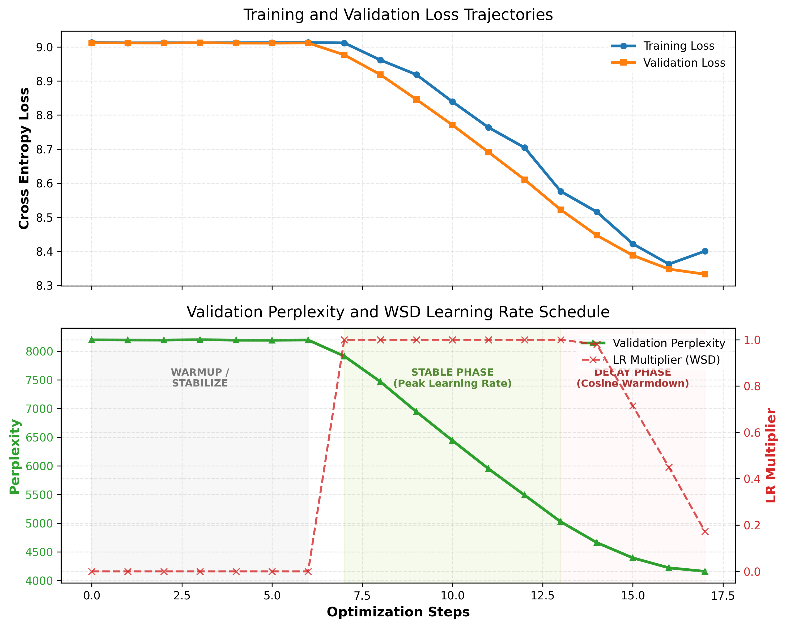
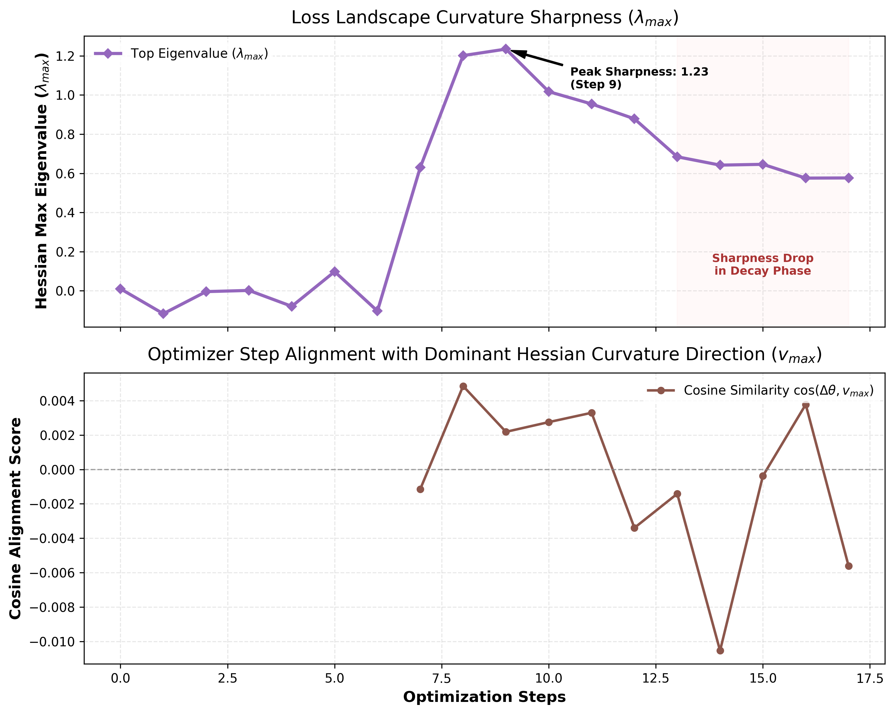

# OptML Miniproject: Implementation Report

This report covers the code structure, the curvature-tracking utilities, and the
results from an initial verification run for our OptML miniproject. The goal is a
configurable baseline for studying transformer loss landscapes: optimization
geometry ($\lambda_{max}$ curvature), WSD scheduling, Muon preconditioning, and
INT8 gradient quantization.

## Overview

We train a small GPT-style model on the DCLM-edu dataset and log loss landscape
indicators during training: the top eigenvalue of the Hessian $\lambda_{max}$,
and the cosine alignment between the optimizer step $\Delta\theta$ and the
dominant curvature direction $v_{max}$. The code runs on Apple Silicon (`mps`)
for local checks and on CUDA GPUs for full runs.

## Code structure

The notebook baseline (`demo.ipynb`) was split into modules at the project root:

```
config/config.yaml       Hydra config
optim/wsd_scheduler.py    Warmup-Stable-Decay scheduler
optim/quantization.py     INT8 gradient quantization hook
reports/project_report.md this report
utils/hvp.py              Hessian-vector products and power iteration
utils/metrics.py          cosine alignment metric
utils/logging.py          CSV and Weights & Biases logging
data.py                   DCLM-edu streaming and tokenizer training
models.py                 GPT model (RoPE, value embeddings, residual gates)
train.py                  training entry point
metrics.csv               per-step metrics
```

## What's implemented

### 1. Hydra config

Model dimensions, vocab size, optimizer, learning rates, sequence length, and
log paths live in `config/config.yaml`. Values can be overridden on the command
line without editing scripts (e.g. `optimizer.type=muon`). `training.device`
accepts `auto`, `cpu`, `cuda`, or `mps`.

### 2. Optimizers and schedule

- WSD scheduler (`optim/wsd_scheduler.py`): linear warmup to the target learning
  rate, a stable phase at peak, then a cosine decay to a fractional minimum,
  driven by global training progress.
- Muon (`train.py`): 2D parameters are preconditioned with Muon while embeddings
  and the LM head are trained with AdamW.

### 3. Hessian geometry metrics

- HVP (`utils/hvp.py`): Hessian-vector products via reverse-over-reverse double
  autograd over the model's `forward()` loss.
- Power iteration: estimates the top eigenvalue $\lambda_{max}$ and eigenvector
  $v_{max}$ of the Hessian.
- Update alignment (`utils/metrics.py`): cosine similarity between the optimizer
  step $\Delta\theta = \theta_{t+1} - \theta_t$ and $v_{max}$.

### 4. INT8 gradient quantization

`optim/quantization.py` registers backward hooks that quantize and dequantize
gradients during `loss.backward()`, simulating low-precision optimization.

### 5. Logging

`CSVLogger` writes one row per evaluation to `metrics.csv`. `WandbLogger` logs to
Weights & Biases when enabled and available, and falls back to CSV otherwise.

## Verification run

The figures below come from an 18-step run logged to `metrics.csv`. It is a
short sanity check, not a full experiment.

### Loss and WSD schedule



In this run the WSD schedule holds the learning rate at 0 during warmup
(steps 0-6) while the curvature metrics are recorded, jumps to peak during the
stable phase (steps 7-13), then cosine-decays (steps 13-17). Validation loss
drops from about 9.0 to 8.33 and perplexity from about 8200 to 4160.

### Curvature and step alignment



$\lambda_{max}$ stays near 0 during warmup, spikes once the stable phase starts
(peaking around 1.23 at step 9), then relaxes during decay (from ~0.68 to ~0.57).
The cosine alignment $\cos(\Delta\theta, v_{max})$ stays small (between about
-0.01 and +0.005), which in a ~$10^7$-parameter space is still above the ~0
expected for random directions.

## Engineering notes

### Hessian autograd and requires_grad

An early version disabled gradients on parameters at the end of
`power_iteration()`, which broke the next training step's backward pass
(`element 0 of tensors does not require grad`). Since `power_iteration()` already
runs inside `@torch.no_grad()`, the manual toggling was redundant and was
removed.

### Double-backward on different devices

The `mps` backend supports the double-backward needed for HVP, so local checks
run fine on Apple Silicon. On CPU, the FlashAttention backward kernel
(`_scaled_dot_product_flash_attention_for_cpu_backward`) does not implement
double derivatives and crashes, so local validation should use
`training.device=mps`. CUDA nodes support it.

## Next steps

The planned sweeps once moved to the cluster:

1. **WSD ablations.** Compare a constant/cosine baseline against WSD and watch
   whether $\lambda_{max}$ drops during the decay phase.
   ```bash
   python train.py training.use_wsd=false training.device=cuda logging.use_wandb=true
   python train.py training.use_wsd=true  training.device=cuda logging.use_wandb=true
   ```
2. **Muon vs. AdamW.** Compare the cosine alignment of update steps with
   $v_{max}$ under the two optimizers.
   ```bash
   python train.py optimizer.type=adamw training.device=cuda logging.use_wandb=true
   python train.py optimizer.type=muon  training.device=cuda logging.use_wandb=true
   ```
3. **Quantization.** Compare $\lambda_{max}$ between float32 and INT8 gradients to
   check whether low precision biases toward flatter minima.
   ```bash
   python train.py training.quantize_grads=false training.device=cuda logging.use_wandb=true
   python train.py training.quantize_grads=true  training.device=cuda logging.use_wandb=true
   ```
